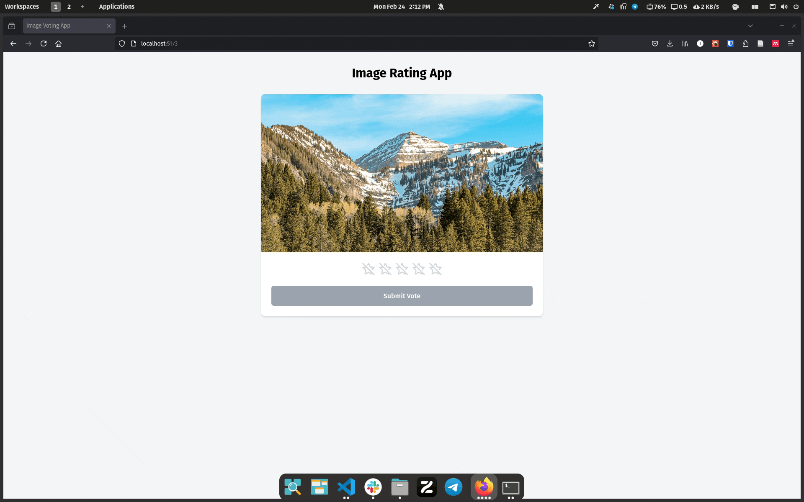

# B1MG Voting App

Voting application that allows users to vote on different B1MG variants.
Users get presented a randomly picked image of a B1MG variant and can vote for it.

<!-- [](docs/ui.gif) -->

## Development Prerequisites

- R (developed with v4.5.0)

## Quickstart

1. Start the Shiny application:

```bash
R -e "renv::restore()"
R -e "B1MGVariantVoting::run_app()"
```

2. Navigate to http://localhost:8000

### AUTHOR

Written by Ivo Christopher Leist, PhD student at CNAG [https://www.cnag.eu](https://www.cnag.eu).

### COPYRIGHT AND LICENSE

Copyright (C) 2025, Ivo Christopher Leist - CNAG.

GPLv3 - GNU General Public License v3.0
