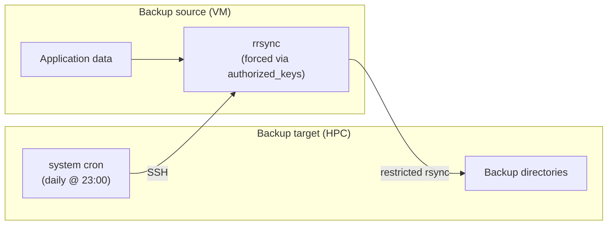

Backup voting snapshots 
=======================

Strategy
--------


Overview
--------
This folder holds the scripts and configuration used to take periodic backups of
the voting app data from the VM. The backup is a timestamped rsync snapshot
stored locally, plus Slack notifications and optional cleanup of old backups and
logs.

What gets backed up
-------------------
The rsync source is the remote host alias "denbi" with a source path of "/".
On the server side, rrsync is locked to the app environment folder, so the
effective backup scope is the app_env data (user_data, server_data, config, images).

In this folder
--------------------
- rsync_from_vm.sh: Performs a single backup run, logs to $HOME/log, updates
	the "latest" symlink, and sends Slack notifications.
- notify_slack.sh: Loads .env and sends success/failure messages to Slack.
- clean_up.sh: Deletes backups and logs in a date window, while protecting the
	current "latest" backups.
- the "templates" folder contains example config files for the backup source and
  target that need to be customized and placed in the appropriate locations.

Backup flow
-----------
1) rsync_from_vm.sh builds a run id based on the timestamp.
2) It sleeps a random 1-60 seconds to avoid shared resource bottlenecks.
3) rsync pulls from "denbi:/" to $HOME/mutation_voting_backup/<RUN_ID>.
4) It updates $HOME/mutation_voting_backup/latest to point at the new snapshot.
5) It writes $HOME/mutation_voting_backup/LAST_SUCCESS with an ISO timestamp.
6) It sends a Slack success notification including snapshot size.
7) On any error, it tails the last 5 log lines and posts a failure notification.

Local paths and outputs
-----------------------
- Backups: $HOME/mutation_voting_backup/<YYYY-MM-DDTHH-MM-SS>
- Latest symlink: $HOME/mutation_voting_backup/latest
- Last success marker: $HOME/mutation_voting_backup/LAST_SUCCESS
- Logs: $HOME/log/rsync_from_vm_<RUN_ID>.log
- Latest log symlink: $HOME/log/latest_rsync_from_vm.log

Setup 
-----

### Create the slack app
- Go to https://api.slack.com/apps?new_app=1 and create a new app in your workspace.
- Under features -> incoming webhooks, activate incoming webhooks
- Add a new webhook for the channel you want to post notifications in
---

### Initial setup on the backup target (here HPC)

- Place the files from this folder in a location of your choice (here $HOME)
- Move the backup_target/_env file to the same location and fill in the Slack webhook URL.
- Add the "denbi" host entry to your ~/.ssh/config using ./backup_target/_ssh_config as a starting point, update the HostName and Port as needed.
- Generate a passwordless SSH key pair: ssh-keygen -t ed25519 -f ~/.ssh/rsync_denbi -N "".
- Add a cron job to run the backup script at your desired frequency, e.g. for daily at 11pm:
  ```bash
  0 23 * * * /$HOME/scripts/rsync_from_vm.sh
  ```
---

### Setup on the backup source (the denbi VM)
- Install rsync
- Create the read-only backup user:
   sudo useradd --system --shell /usr/sbin/nologin backup_ro
- Create a .ssh directory for the backup user
   sudo mkdir -p /home/backup_ro/.ssh
- Copy the template file backup_source/_authorized_keys to /home/backup_ro/.ssh/authorized_keys and replace <BACKUP_TARGET_IP> with the IP address of the backup target (HPC login node) and <BACKUP_SOURCE_PATH> with the path you want to back up (e.g. /srv/shiny-server/b1mg-mutation-voter-beta/app_env/).
> [!TIP]
  > To get the IP address of the backup target, put a random IP after `from=`,
  > then try to SSH from the backup target to the backup source using the `denbi` host entry.
  > Check the `auth.log` on the backup source. You should see a message like:
  >
  > ```
  > /home/backup_ro/.ssh/authorized_keys:1: Authentication tried for backup_ro with correct key but not from a permitted host (host=<RANDOM_IP>, ip=<RANDOM_IP>, required=<BACKUP_TARGET_IP>)
  > ```
  > The IP after "required=" is the one of interest.

- Set ownership and permissions for the backup user's .ssh directory and authorized_keys file:
  ```bash
  sudo chown -R backup_ro:backup_ro /home/backup_ro/.ssh
  sudo chmod 700 /home/backup_ro/.ssh
  sudo chmod 600 /home/backup_ro/.ssh/authorized_keys
  ```

Cleaning up old backups and logs
--------------------------------
Usage:
	`./clean_up.sh <start_date> <end_date>`
Example:
	`./clean_up.sh 2026-01-01 2026-01-31`
